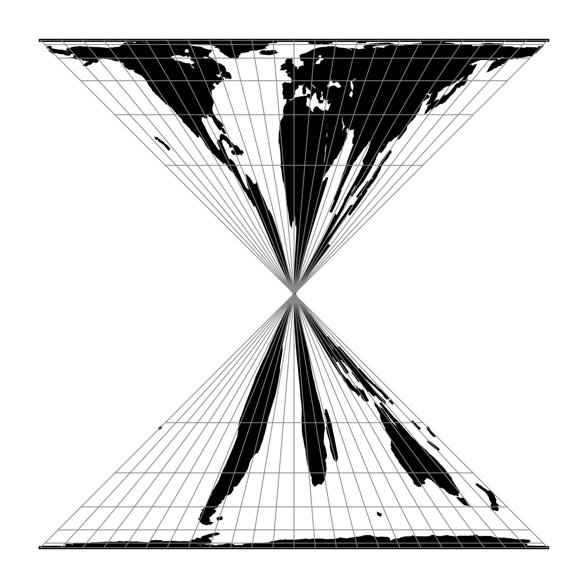

.. _hourglass:

********************************************************************************
Hourglass
********************************************************************************

Snyder's Hourglass projection, using the extended formulas described in XXX.

.. versionadded:: 9.8.0

+---------------------+----------------------------------------------------------+
| **Classification**  | Pseudo cylindrical, equal area                           |
+---------------------+----------------------------------------------------------+
| **Available forms** | Forward and inverse, spherical, ellipsoidal              |
+---------------------+----------------------------------------------------------+
| **Defined area**    | Global                                                   |
+---------------------+----------------------------------------------------------+
| **Alias**           | hourglass                                                |
+---------------------+----------------------------------------------------------+
| **Domain**          | 2D                                                       |
+---------------------+----------------------------------------------------------+
| **Input type**      | Geodetic coordinates                                     |
+---------------------+----------------------------------------------------------+
| **Output type**     | Projected coordinates                                    |
+---------------------+----------------------------------------------------------+

   proj-string: ``+proj=hourglass``

Parameters
################################################################################

.. note:: All parameters are optional.

.. include:: ../options/lon_0.rst

.. include:: ../options/R.rst

.. option:: +n=<value>

    Exponent applied to the meridians shape.
    Snider's image used 1.

    *Defaults to 1.*

.. option:: +s=<value>

    Aspect ratio of the total projection.
    "Landscape" map has "s" less than 1
    Snider's image used 0.5.

    *Defaults to 1.*

.. option:: +outinvalid=<value>

    Integer value setting the scope of the inverse transformation.
    A value of 1 plots only the hourglass.
    Values greater than 1 extend the covered area. 0 covers the entire area.

    *Defaults to 1.*
